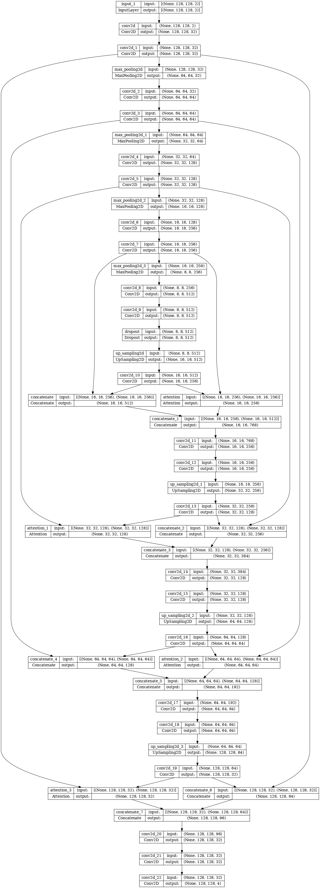

# BraTS2020 TensorFlow Brain Tumor Segmentation

Brain tumor segmentation on **BraTS 2020 MRI scans** using **TensorFlow / Keras** and U-Net-based deep learning models.

This project performs slice-based segmentation on BraTS 2020 NIfTI medical images. It uses MRI modalities as input, trains a U-Net-style neural network, and predicts tumor regions from brain MRI slices.

> This project is for research and educational purposes only. It is not intended for clinical diagnosis.

---

## Overview

The pipeline converts 3D BraTS MRI volumes into 2D training slices and performs multi-class tumor segmentation.

```text
BraTS MRI volumes → preprocessing → 2D U-Net / Attention U-Net → tumor mask prediction
```

The model is designed to segment tumor regions from MRI data using TensorFlow and Keras.

---

## Features

- TensorFlow / Keras implementation
- U-Net and Attention U-Net model variants
- BraTS 2020 NIfTI dataset support
- Slice-based MRI segmentation
- Multi-class tumor mask prediction
- Dice coefficient metric
- Mean IoU metric
- Precision, sensitivity, and specificity metrics
- Per-class Dice evaluation
- Training logs and model checkpointing
- Prediction visualization

---

## Model Architecture

The repository includes U-Net-based architectures implemented in `AttentionUnet.py`.

The default model uses MRI slices as input and predicts a segmentation mask for each pixel.



---

## Segmentation Classes

| Class | Description |
|---|---|
| 0 | Background |
| 1 | Necrotic / Core tumor |
| 2 | Edema |
| 3 | Enhancing tumor |

BraTS label `4` is mapped to class `3` during preprocessing.

---

---

## Dataset

This project uses the **BraTS 2020** brain tumor segmentation dataset.

Expected dataset structure:

```text
MICCAI_BraTS2020_TrainingData/
├── BraTS20_Training_001/
│   ├── BraTS20_Training_001_flair.nii
│   ├── BraTS20_Training_001_t1.nii
│   ├── BraTS20_Training_001_t1ce.nii
│   ├── BraTS20_Training_001_t2.nii
│   └── BraTS20_Training_001_seg.nii
├── BraTS20_Training_002/
│   └── ...
└── ...
```

The current pipeline mainly uses:

```text
FLAIR
T1ce
Segmentation mask
```

---

## Project Structure

```text
├── AttentionUnet.py        # U-Net and Attention U-Net architectures
├── config.py               # Dataset paths and hyperparameters
├── trainer.py              # Training script
├── prediction.py           # Prediction script
├── images/                 # Model architecture images
├── predictResults/         # Prediction output samples
├── trainingResults/        # Training logs and result files
├── preTrainedWeights/      # Saved/pretrained model weights
└── utils/
    ├── dataGenerator.py    # Data loading and preprocessing
    ├── coEFFMatrix.py      # Metrics
    ├── plotting.py         # Visualization utilities
    └── testDatasets.py     # Dataset testing utilities
```

---

## Installation

```bash
git clone https://github.com/mahdizynali/BraTS2020-Tensorflow-Brain-Tumor-Segmentation.git
cd BraTS2020-Tensorflow-Brain-Tumor-Segmentation
```

Install dependencies:

```bash
pip install tensorflow keras numpy pandas opencv-python nibabel scikit-learn scikit-image matplotlib
```

---

## Configuration

Before training, update the dataset paths in `config.py`:

```python
TRAIN_DATASET_PATH = "/path/to/MICCAI_BraTS2020_TrainingData/"
VALIDATION_DATASET_PATH = "/path/to/MICCAI_BraTS2020_ValidationData/"
```

Main settings:

```python
IMG_SIZE = 128
VOLUME_SLICES = 120
VOLUME_START = 10
SAVE_MODEL_PATH = "model.h5"
SAVE_LOG_PATH = "training.log"
```

Training hyperparameters:

```python
lossFunction = "categorical_crossentropy"
learningRate = 0.001
batchSize = 1
epochs = 50
modelDropout = 0.2
```

---

## Training

Run:

```bash
python trainer.py
```

The training script loads BraTS patient folders, generates 2D MRI slices, trains the selected U-Net model, and saves the trained model and logs.

---

## Prediction

Run:

```bash
python prediction.py
```

Prediction outputs are saved in:

```text
predictResults/
```

---

## Results

Fill this section after training.

### Overall Metrics

| Metric | Value |
|---|---:|
| Accuracy | `TODO` |
| Mean IoU | `TODO` |
| Dice Coefficient | `TODO` |
| Precision | `TODO` |
| Sensitivity | `TODO` |
| Specificity | `TODO` |

### Per-Class Dice

| Tumor Region | Dice |
|---|---:|
| Necrotic / Core tumor | `TODO` |
| Edema | `TODO` |
| Enhancing tumor | `TODO` |

### Training Curves

Add your training curves here after training:

```md

```

---

## Metrics

The project includes segmentation metrics in `utils/coEFFMatrix.py`:

- Dice coefficient
- Mean IoU
- Precision
- Sensitivity
- Specificity
- Per-class Dice scores

---

## Notes

This project performs **2D slice-based segmentation** from 3D BraTS MRI volumes.

It does not train a full 3D segmentation network. Each selected MRI slice is resized and processed as a 2D image.

---
